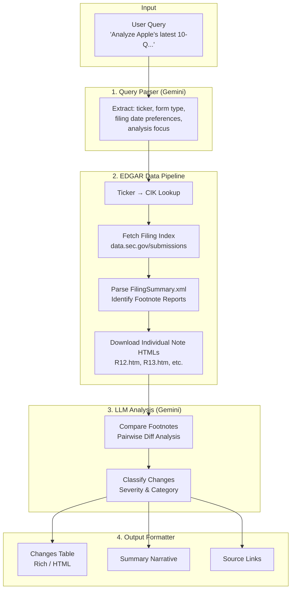

# SEC EDGAR Footnote Analysis Agent

Build an LLM-powered Python agent that helps financial analysts detect and analyze changes in the footnotes of SEC 10-K/10-Q filings. The agent accepts natural language queries specifying a company (name or ticker) and filing preferences, fetches the relevant filings from EDGAR, extracts the "Notes to Financial Statements" sections, and uses the Google Gemini API to compare footnotes across filings — producing a structured table of significant changes and a narrative summary.

## User Review Required

> [!IMPORTANT]
> **Gemini API Key**: This implementation uses the Google Gemini API (`google-genai` SDK). You will need a `GEMINI_API_KEY` environment variable set before running. A free-tier key is sufficient for moderate usage. Get one at [https://aistudio.google.com/apikey](https://aistudio.google.com/apikey).

> [!WARNING]
> **SEC EDGAR Fair Access Policy**: The SEC requires all programmatic access to include a `User-Agent` header with your name and email (e.g., `"YourName your@email.com"`). The agent will prompt for this on first run and store it in a local `.env` file. The SEC enforces a 10-requests-per-second rate limit.

> [!IMPORTANT]
> **Filing Pair Selection**: The agent will let the user specify which filings to compare in their natural language query. If the user doesn't specify, it defaults to comparing the latest filing vs. the immediately preceding filing of the same type.

## Open Questions

1. **Offline mode**: Should the agent cache previously downloaded filings locally for faster re-analysis, or always fetch fresh from EDGAR? *(Plan assumes: yes, cache locally in a `cache/` directory.)*
2. **Maximum footnote size**: Some 10-K footnotes can be 50,000+ words. Should we truncate/chunk for LLM processing or use the full context? *(Plan assumes: use Gemini's large context window (up to 1M tokens) and send complete footnotes.)*
3. **Output format**: The plan produces both console output (rich tables) and an optional HTML report. Is Markdown file export also needed?

---

## Architecture Overview



---

## Proposed Changes

### Project Structure

```
project/
├── main.py                  # CLI entry point
├── app.py                   # Streamlit web UI (optional)
├── config.py                # Configuration & environment management
├── edgar_client.py          # SEC EDGAR API client
├── footnote_extractor.py    # HTML parsing & footnote extraction
├── query_parser.py          # LLM-powered natural language query parsing
├── analyzer.py              # LLM-powered footnote comparison & analysis
├── output_formatter.py      # Table & report generation
├── requirements.txt         # Python dependencies
├── .env.example             # Example environment variables
├── README.md                # Usage documentation
└── cache/                   # Local filing cache (auto-created)
```

---

### Configuration & Environment

#### [NEW] [config.py](file:///c:/Users/HP/Desktop/ISAN%205318/project/config.py)

Centralized configuration:
- Load `GEMINI_API_KEY` from environment / `.env` file
- Load `SEC_USER_AGENT` (required by SEC: `"Name email@example.com"`)
- Constants: SEC API base URLs, rate limit settings, cache directory path
- Gemini model name config (default: `gemini-2.5-flash`)

#### [NEW] [.env.example](file:///c:/Users/HP/Desktop/ISAN%205318/project/.env.example)

```
GEMINI_API_KEY=your_api_key_here
SEC_USER_AGENT=YourName your@email.com
```

#### [NEW] [requirements.txt](file:///c:/Users/HP/Desktop/ISAN%205318/project/requirements.txt)

```
google-genai>=1.0.0
requests>=2.31.0
beautifulsoup4>=4.12.0
lxml>=5.0.0
rich>=13.0.0
python-dotenv>=1.0.0
streamlit>=1.35.0
pydantic>=2.0.0
```

---

### EDGAR Data Pipeline

#### [NEW] [edgar_client.py](file:///c:/Users/HP/Desktop/ISAN%205318/project/edgar_client.py)

Handles all SEC EDGAR API interactions:

**`EdgarClient` class:**
- `__init__(user_agent: str)`: Set up `requests.Session` with required `User-Agent` header and rate-limiting (≤10 req/s via `time.sleep(0.12)` between requests)
- `ticker_to_cik(ticker: str) -> str`: Download `https://www.sec.gov/files/company_tickers.json`, cache locally, find CIK from ticker. Zero-pad to 10 digits (`CIK{str(cik).zfill(10)}`)
- `company_name_to_cik(name: str) -> str`: Fuzzy match company name against the tickers JSON using case-insensitive substring matching
- `get_submissions(cik: str) -> dict`: Fetch `https://data.sec.gov/submissions/CIK{padded_cik}.json` — returns recent filings metadata including accession numbers, filing dates, form types, and primary document filenames
- `get_filings_list(cik: str, form_type: str) -> list[FilingMeta]`: Filter submissions to only 10-K or 10-Q, return list of `FilingMeta` objects with `{accession_number, filing_date, report_date, primary_document, base_url}`
- `get_filing_summary_xml(base_url: str) -> str`: Download `FilingSummary.xml` from the filing's archive directory — this manifest lists every footnote as an isolated HTML file
- `download_note_html(base_url: str, html_filename: str) -> str`: Download an individual footnote HTML file (e.g., `R12.htm`) — these are small (~30KB) pre-isolated files containing a single note
- `download_filing_html(base_url: str, primary_doc: str) -> str`: Download the full filing HTML (fallback for filings without FilingSummary.xml)
- `get_filing_url(accession_number: str, primary_doc: str) -> str`: Construct the SEC archive URL for source linking

**`FilingMeta` data class (Pydantic):**
```python
class FilingMeta(BaseModel):
    accession_number: str        # e.g., "0000320193-24-000106"
    filing_date: str             # e.g., "2024-11-01"
    report_date: str             # e.g., "2024-09-28"
    form_type: str               # "10-K" or "10-Q"
    primary_document: str        # e.g., "aapl-20240928.htm"
    base_url: str                # Archive directory URL
    sec_url: str                 # Full URL to the primary document
```

**Rate limiting**: `time.sleep(0.12)` between requests to stay under 10 req/s. Implement exponential backoff on 429/403 responses.

**Caching**: Store downloaded files in `cache/{accession_number_nodash}/` directory. Check cache before making network requests.

---

### Footnote Extraction

#### [NEW] [footnote_extractor.py](file:///c:/Users/HP/Desktop/ISAN%205318/project/footnote_extractor.py)

Uses a two-tier strategy for maximum reliability:

**Primary method — `FilingSummary.xml`** (works for all iXBRL filings since ~2019):
The SEC renders each footnote as a standalone HTML file (`R12.htm`, `R13.htm`, etc.) and publishes a manifest at `{filing_base_url}/FilingSummary.xml`. This XML categorizes reports by `<MenuCategory>` — footnotes are tagged as `"Notes"`. This avoids parsing a 50MB+ monolithic filing.

**Fallback method — HTML parsing with BeautifulSoup** (for older filings lacking FilingSummary.xml):
Regex-search for the "Notes to Financial Statements" header, then extract content until the next major section.

**`FootnoteExtractor` class:**
- `extract_footnotes(edgar_client, filing_meta: FilingMeta) -> list[Footnote]`: Main entry point. Tries FilingSummary.xml first, falls back to HTML parsing.
- `_extract_via_filing_summary(edgar_client, filing_meta) -> list[Footnote]`:
  1. Download `FilingSummary.xml` from the filing's archive directory
  2. Parse XML to find all `<Report>` elements where `<MenuCategory>` is "Notes"
  3. For each note, read `<ShortName>` (title) and `<HtmlFileName>` (e.g., `R12.htm`)
  4. Download each individual note HTML file (these are small, ~30KB each)
  5. Parse with BeautifulSoup to extract clean text, preserving table structures
- `_extract_via_html_parsing(html: str) -> list[Footnote]`: Fallback for older filings:
  1. Regex search: `re.compile(r"notes?\s+to\s+(condensed\s+)?(consolidated\s+)?financial\s+statements", re.IGNORECASE)`
  2. Find parent structural element, extract to next major section header
  3. Split into individual notes by numbered headers
- `_clean_note_html(html: str) -> str`: Strip formatting tags, normalize whitespace, convert tables to readable text format
- `_extract_note_number_and_title(short_name: str) -> tuple[int, str]`: Parse titles like "Note 1 - Summary of Significant Accounting Policies" → `(1, "Summary of Significant Accounting Policies")`

**`Footnote` data class (Pydantic):**
```python
class Footnote(BaseModel):
    number: int           # Note number (1, 2, 3...)
    title: str            # e.g., "Summary of Significant Accounting Policies"
    content: str          # Full cleaned text content of the note
    raw_html: str         # Original HTML for reference
    source_url: str       # Direct URL to the isolated note HTML on SEC.gov
```

---

### Query Parsing

#### [NEW] [query_parser.py](file:///c:/Users/HP/Desktop/ISAN%205318/project/query_parser.py)

Uses Gemini to parse natural language queries into structured parameters:

**`QueryParser` class:**
- `parse(user_input: str) -> ParsedQuery`: Send the user's query to Gemini with a structured output schema to extract:

**`ParsedQuery` data class (Pydantic):**
```python
class ParsedQuery(BaseModel):
    company_name: str | None      # e.g., "Apple"
    ticker: str | None            # e.g., "AAPL"
    form_type: str                # "10-K" or "10-Q"
    filing_period_current: str | None   # e.g., "latest", "Q2 2025", "2024"
    filing_period_previous: str | None  # e.g., "previous", "Q1 2025", "Q2 2024"
    focus_areas: list[str]        # e.g., ["revenue recognition", "debt"]
    comparison_type: str          # "sequential" or "year-over-year" or "custom"
```

**Gemini prompt strategy**: Use `response_mime_type='application/json'` with `response_json_schema` set to the Pydantic model schema for reliable structured extraction.

---

### LLM Analysis Engine

#### [NEW] [analyzer.py](file:///c:/Users/HP/Desktop/ISAN%205318/project/analyzer.py)

The core comparison logic using Gemini:

**`FootnoteAnalyzer` class:**
- `compare_footnotes(current: list[Footnote], previous: list[Footnote], focus_areas: list[str] | None) -> AnalysisResult`: 
  1. **Structural diff**: Match footnotes by number/title between the two filings
  2. **Detect additions/removals**: Notes present in one but not the other
  3. **LLM deep comparison**: For each matched pair, send both texts to Gemini with a comparison prompt
  4. **Classify changes**: Severity (HIGH / MEDIUM / LOW), category (new disclosure, removed disclosure, language change, quantitative change, accounting policy change, risk factor change)

**Gemini prompt for comparison** (key design):
```
You are a senior financial analyst reviewing SEC filing footnotes.

Compare these two versions of Note {n}: "{title}"

=== CURRENT FILING ({current_date}) ===
{current_text}

=== PREVIOUS FILING ({previous_date}) ===  
{previous_text}

Identify ALL significant changes. For each change:
1. What specifically changed (quote the relevant text)
2. Category: [New Disclosure | Removed Disclosure | Language Change | 
   Quantitative Change | Accounting Policy Change | Risk Factor Change | 
   Reclassification | Estimate Revision]
3. Severity: [HIGH | MEDIUM | LOW]
4. Why this matters to an analyst
5. Recommended action
```

**`AnalysisResult` data class (Pydantic):**
```python
class Change(BaseModel):
    note_number: int
    note_title: str
    change_description: str
    category: str
    severity: str          # HIGH, MEDIUM, LOW
    current_text_excerpt: str
    previous_text_excerpt: str
    analyst_implication: str
    recommended_action: str

class AnalysisResult(BaseModel):
    company: str
    current_filing: str    # e.g., "10-Q filed 2025-08-01"
    previous_filing: str   # e.g., "10-Q filed 2025-05-02"
    changes: list[Change]
    summary: str           # Overall narrative summary
    notes_added: list[str]    # Notes in current but not previous
    notes_removed: list[str]  # Notes in previous but not current
```

**Processing strategy for large filings**: 
- Process each note pair individually (map step)
- Then synthesize all changes into an overall summary (reduce step)
- This keeps each Gemini call focused and within reasonable context

---

### Output Formatting

#### [NEW] [output_formatter.py](file:///c:/Users/HP/Desktop/ISAN%205318/project/output_formatter.py)

Formats the `AnalysisResult` for display:

**`OutputFormatter` class:**
- `print_console(result: AnalysisResult)`: Use the `rich` library to print:
  - A header with company name, filing dates, and SEC URLs
  - A colored table of changes sorted by severity (HIGH=red, MEDIUM=yellow, LOW=green)
  - Columns: `#`, `Note`, `Category`, `Severity`, `Change Description`, `Analyst Implication`
  - A summary narrative block below the table
  - Expandable sections for added/removed notes
- `to_html(result: AnalysisResult) -> str`: Generate a standalone HTML report with:
  - Styled table with color-coded severity
  - Collapsible detail sections for each change (showing current vs. previous text excerpts)
  - Source filing links to SEC EDGAR
  - Summary section
- `to_markdown(result: AnalysisResult) -> str`: Generate a Markdown version of the report

---

### CLI Entry Point

#### [NEW] [main.py](file:///c:/Users/HP/Desktop/ISAN%205318/project/main.py)

Command-line interface:

```python
def main():
    """
    Flow:
    1. Load configuration (API keys, user-agent)
    2. Accept user query (interactive prompt or command-line arg)
    3. Parse query → structured parameters (QueryParser)
    4. Resolve company → CIK (EdgarClient)
    5. Fetch filing list, select the two filings to compare
    6. Download filing HTML for both filings
    7. Extract footnotes from both (FootnoteExtractor)
    8. Compare footnotes (FootnoteAnalyzer)
    9. Format & display results (OutputFormatter)
    10. Optionally save HTML report
    """
```

- Support both interactive mode (`python main.py`) and one-shot mode (`python main.py "Analyze Apple's..."`)
- Handle errors gracefully: invalid ticker, no filings found, API key missing
- Show progress indicators using `rich` console

---

### Web UI (Optional)

#### [NEW] [app.py](file:///c:/Users/HP/Desktop/ISAN%205318/project/app.py)

Streamlit-based web interface:
- Text input box for the natural language query
- "Analyze" button to trigger the pipeline
- Spinner while processing
- Results displayed as:
  - Streamlit `st.dataframe()` for the changes table
  - `st.markdown()` for the summary
  - Expandable sections (`st.expander()`) for detailed change excerpts
  - Download button for HTML report
- Sidebar with configuration (API key input if not in env, user-agent)

---

### Documentation

#### [NEW] [README.md](file:///c:/Users/HP/Desktop/ISAN%205318/project/README.md)

- Project overview and purpose
- Installation instructions (`pip install -r requirements.txt`)
- Configuration (`.env` setup)
- Usage examples (CLI and web UI)
- Example queries and expected output
- Architecture diagram
- Limitations and caveats

---

## Verification Plan

### Automated Tests

Run the full pipeline end-to-end against a known company:

```bash
# Test with Apple's 10-Q (well-structured, reliable filings)
python main.py "Compare Apple's two most recent 10-Q filings and highlight footnote changes"

# Test with a smaller company (edge case: different HTML structures)
python main.py "Analyze Microsoft's latest 10-K footnotes vs the previous 10-K"

# Test ticker input
python main.py "Show me footnote changes in TSLA's latest 10-Q vs previous quarter"
```

### Manual Verification

1. **Verify EDGAR data accuracy**: Cross-check that the downloaded filing matches what's on SEC.gov by clicking the source links in the output
2. **Verify footnote extraction**: Manually inspect that the extracted footnotes match the actual filing content (spot-check 2-3 notes)
3. **Verify LLM analysis quality**: Compare the agent's identified changes against a manual reading of the footnotes to check for false positives and missed changes
4. **Test the Streamlit UI**: Run `streamlit run app.py` and verify the full workflow through the browser
5. **Test error handling**: Try invalid tickers, non-existent filings, missing API keys
